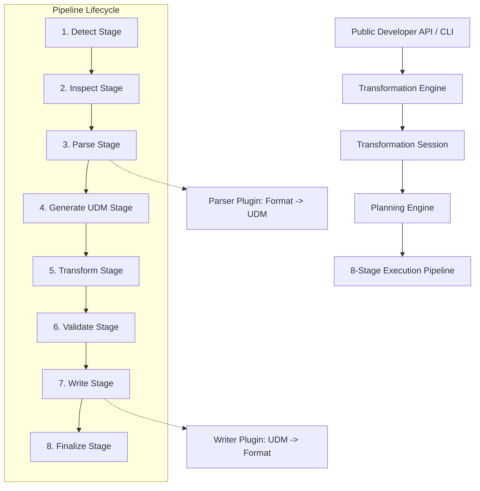

# System Architecture

Treqna is designed as a layered, plugin-driven transformation engine centered around the Universal Data Model (UDM).

## High-Level Architecture Diagram

## Architectural Principles

1. **No Direct Format Conversion**: All formats convert to and from UDM tree nodes.
2. **Immutable Objects**: Result objects, statistics, descriptors, and options are frozen dataclasses.
3. **Explicit Capability Registration**: Format descriptors declare exact MIME types, extension aliases, and features.
4. **Deterministic Pipeline**: Every transformation follows the identical 8-stage lifecycle.

