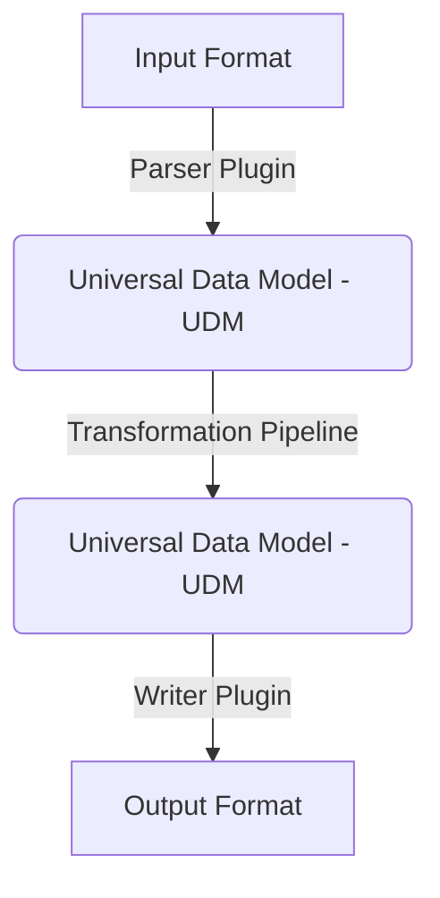

# Getting Started with Treqna

Welcome to Treqna! This guide introduces the core concepts and design philosophy of Treqna.

## Core Design Philosophy

Traditional format converters build direct pairings between file formats (e.g. CSV to JSON, JSON to XML). When supporting $N$ file formats, direct conversion requires $N \times (N - 1)$ separate converters.

Treqna replaces direct conversion with a **Universal Data Model (UDM)** intermediate layer.

By decoupling reading and writing:
1. Adding a new format requires only **1 Parser** (`Format -> UDM`) and **1 Writer** (`UDM -> Format`).
2. Overall system complexity remains strictly $O(N)$.
3. Transformations operate directly on the UDM data tree, working seamlessly across all present and future formats.

