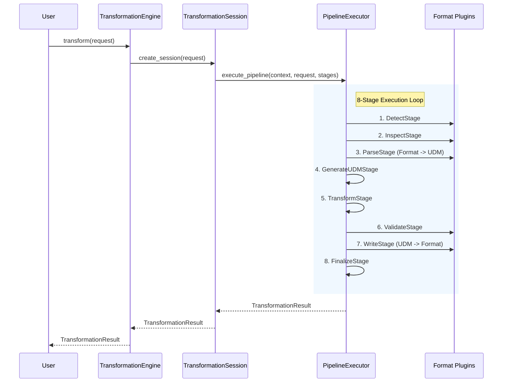

# Kernel Engine Architecture

The **Transformation Engine Kernel** coordinates sessions, pipeline execution, and lifecycle management.

## 8-Stage Pipeline Sequence Diagram

## Kernel Modules

- `TransformationEngine`: Engine entry point managing configuration, discovery, and sessions.
- `PipelineExecutor`: Runs sequence of 8 pipeline stages.
- `LifecycleManager`: Tracks active sessions and memory cleanup.

