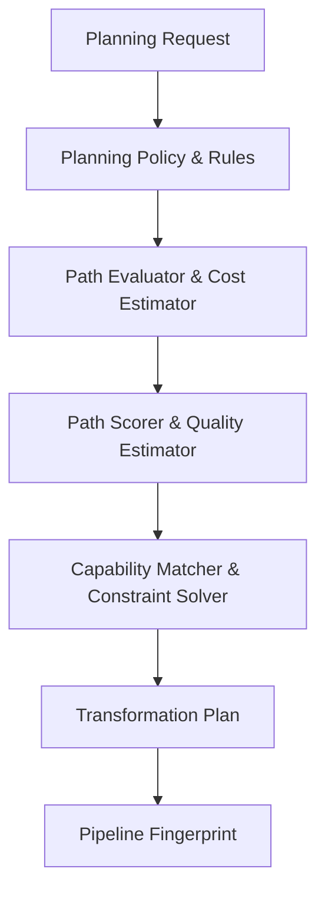

# Planning System Architecture

The **Planning System** decides *how* a transformation request should execute without performing execution itself.

## Planner Decision Diagram

## Core Planning Primitives

- `Planner`: Facade managing route discovery and cost scoring.
- `TransformationPlan`: Immutable plan containing plan nodes, edges, cost metrics, quality scores, and stable `PipelineFingerprint`.
- `CostEstimator` & `QualityEstimator`: Abstract estimators rating execution cost and metadata preservation scores.
- `ConstraintSolver`: Solves format compatibility constraints.
