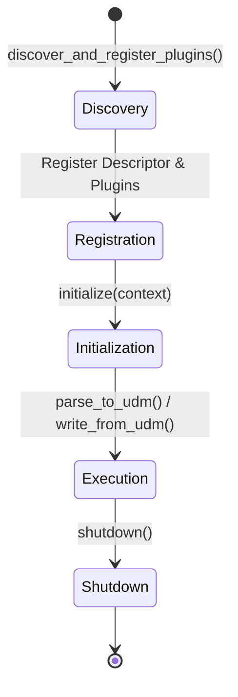

# Plugin System Architecture

Treqna features a plugin architecture where formats register explicit `FormatDescriptor` metadata and plugin implementations.

## Plugin Lifecycle Diagram



## Plugin Interfaces

- `ParserPluginInterface`: Implements `parse_to_udm(source_data, context) -> UDMDocument`.
- `WriterPluginInterface`: Implements `write_from_udm(document, context) -> str`.
- `FormatDetectorInterface`: Implements `detect_format(source_data) -> str`.
- `FormatInspectorInterface`: Implements `inspect_schema(source_data) -> Mapping`.
- `FormatValidatorInterface`: Implements `validate_csv_structure(source_data) -> tuple`.

## Creating a Plugin

```python
from treqna.plugins import ParserPluginInterface, PluginMetadata
from treqna.core.udm import UDMDocument, UDMTabular

class MyCustomParser(ParserPluginInterface):
    @property
    def metadata(self) -> PluginMetadata:
        return PluginMetadata(
            name="custom_parser",
            version="1.0.0",
            format_identifier="custom",
            description="Custom parser plugin",
            supported_media_types=("text/plain",),
        )

    @property
    def format_identifier(self) -> str:
        return "custom"

    def initialize(self, context) -> None:
        pass

    def shutdown(self) -> None:
        pass

    def parse_to_udm(self, source_data, context) -> UDMDocument:
        return UDMDocument(root=UDMTabular(columns=("col",), rows=(("val",),)))
```
