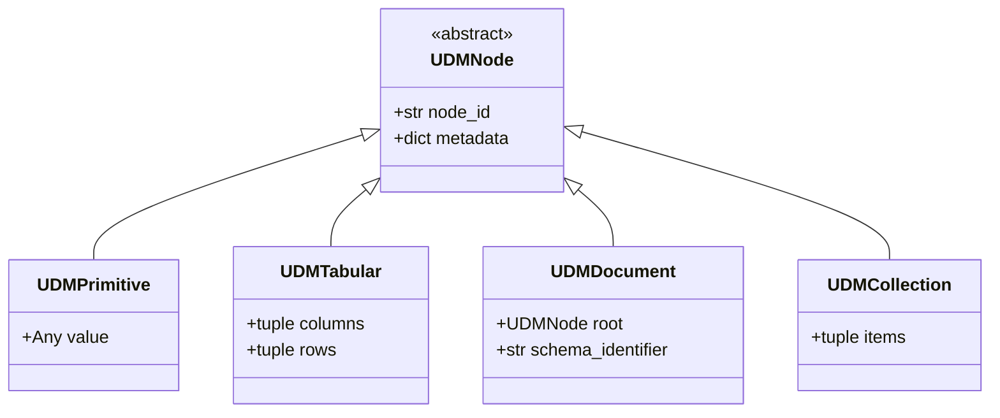

# Universal Data Model (UDM)

The **Universal Data Model (UDM)** is the core data tree representation in Treqna. All input formats parse into UDM, and all output formats write from UDM.

## UDM Node Hierarchy Diagram

## Node Types

- `UDMDocument`: Root document wrapper holding a schema identifier and root node.
- `UDMTabular`: Tabular dataset storing column names and row tuples.
- `UDMPrimitive`: Leaf node holding scalar primitives (strings, numbers, booleans).
- `UDMCollection`: Ordered collection of UDM nodes.
